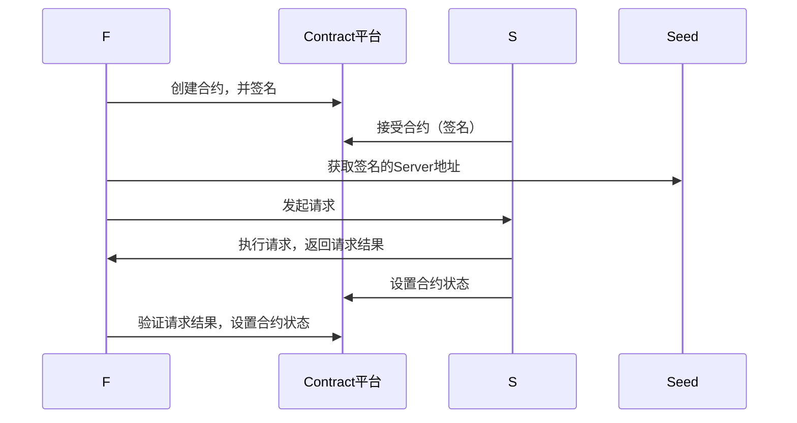
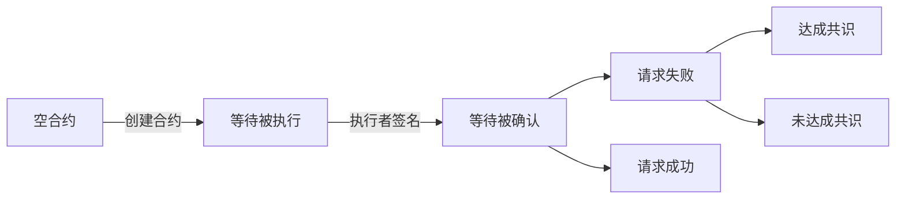
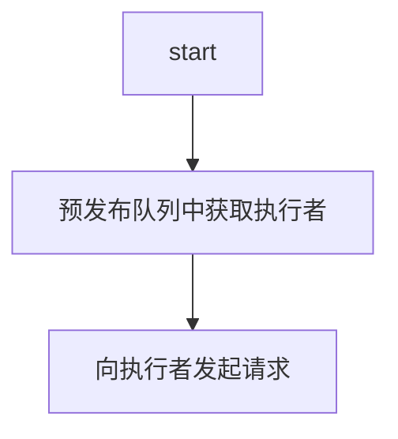
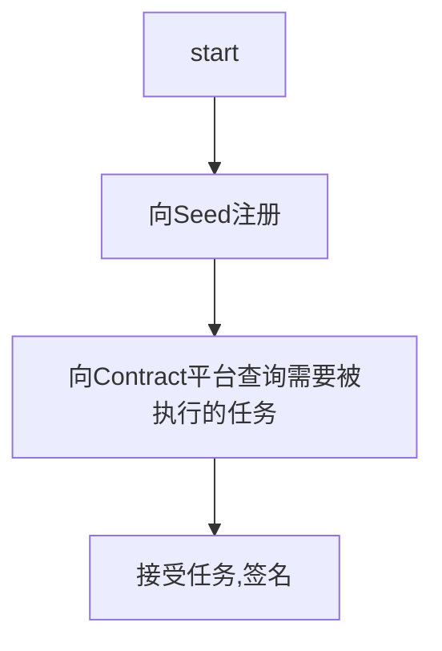

 #共享机场设计概要

## 说明

使用去中心化的方式，将个人的 代理服务器共享出来。

服务器提供者能够根据**<u>代理获取的信息价值</u>**收取一定的费用

信息请求方（客户端）付一定 的费用得到自己想要的信息

## 使用技术点分析

- 区中心化平台使用EOS

  原因：

  1. 智能合约编写方便
  2. 运行智能合约不收钱

- 代理协议使用SOCK5

  原因：

  1. 有许多参考代码
  2. 翻墙方便

- 服务端和客户段通信模式采用p2p

  1. 有些服务端在内网的情况，也能使用（没什么大用处吧，大概）

- 智能合约状态转换图（用流程图将就下）


## 技术点预研

SOCK5： https://github.com/luojiantao/Sock5Proxy （C++）

EOS-ecc的使用（C++版本）：https://github.com/luojiantao/EOS_study

p2p网络通信（python）：https://github.com/luojiantao/p2pHttpPorxy

# 方案设计

## 架构图


F: 合约创建者，代理请求转发客户端

S：合约执行者，SOCK5服务器

Seed：种子服务器，提供SOCK5寻址服务



## Contract平台

#### 合约数据结构如下：

```c++
using Msg = string;//msg 使用JSON格式记录，请求内容，方便扩展
/*
{
    "size": "Msg 长度",
    "attr":{
        "info_form_addr": "希望请求信息，来自什么地区"
    }
}*/
class Contract{
    public:
    Contract(uint64_t);
    bool FristSign(string sign, string, uint64_t value);
    bool SetReqDate(Msg req);
    void SetFristCheck(bool);
    
    bool SecondSign(string sign, string pub_key, uint64_t value);
        
    private:
    string m_frist_sign;//数字签名，checksum由发起者自己保存，到时候自己确认
    string m_frist_name;
    Msg m_req_data;
    bool m_frist_check;//false
    
    string m_second_sign;//数字签名，checksum由领取任务者自己保存，到时候自己确认
    string m_second_name;
    bool m_second_check;//false
    
    string m_hash;//这个合约的hash
    string m_next_hash;
    int value;
};
```

#### 一次交易状态图


状态解释

- 【等待被执行】

  创建合约。需要支付一定的费用，来奖励合约执行者。

  合约创建者签名。需要支付一定发费用，防止赖账行为

- 【等待被确认】

  合约执行者签名，需要抵押一定的token(合约创建时指定)。合约状态为 **<u>请求成功</u>**或**<u>达成共识</u>**时返还，防止接受了合约不执行

- 【请求成功】

  合约创建者，得到抵押的签名费用

  合约执行者，或者执行奖励和自己抵押的签名费用

- 【请求失败】

  合约创建者任务执行任务为失败

- 【达成共识】

  合约执行者也认为执行失败。合约取消，各自回收付出的token

- 【未达成共识】

  不能判断，是否有恶意成分。暂时处理：没收双方抵押的token，包括创建合约付出的token

## 请求发起者

### 设计概括

#### 存在问题

由于EOS智能合约，是一个独立的环境。不能够，主动通知外界，合约状态发生了变化。所以需要使用轮询的方法监听和约的状态。在这种情况下，发布任务和接受任务之间必然会有一个时间差，从而影响性能。

为了缓解这种情况，引入一种类似缓存的机制。姑且叫预发布

##### 预发布：

​	假设：一共发布了N个任务，一个合约由发布到状态为等待被执行，时间为x，合约状态变为等待确认的平均时间为y。轮询一次时间为T。指定满足如下公式时，才能执行一次任务

​                                                            T + x > y

T决定了F执行任务的上线，即每秒最多执行1/T次。但是y是由当时的网络环境（请求执行者的数量和网络情况）决定的，而且如果同步方式轮询公式就如下

​                                                           T + Nx > y

如果，我们预先发布N个任务，即在真正执行请求前，已经由N个请求执行者正已经签下合约，等待我们向他们发送请求。

当N始终大于需要发布问任务数时，执行任务耗时就和合约无关。

而一个合约发布到合约状态变为等待被确认时间如下，x为EOS网络响应时间。y为合约执行者平均签名时间，P为线程数，预发布任务补偿速度如下，（也不需要轮询了。因为，每次执行任务者都是冲预发布任务队列中获取）

​                                               （1/（ y+x+x）） * P

##### 缺点：

​	一开始需要教多的token作抵押。



## 请求执行者



